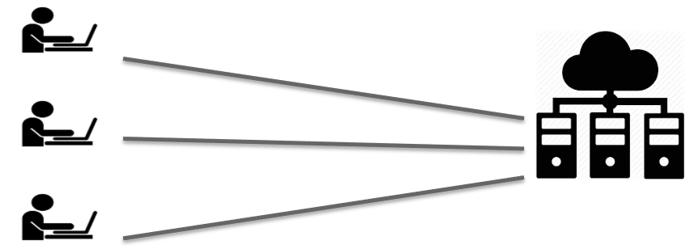

# Environnement de travail

{: style="height:150px;width:150px"; align=right}

## Comment travailler sur le serveur ?

{: style="height:25s0px;width:400px"} 

### Protocole ssh

{: style="height:50px;width:70px"; align=left}  

* En se connectant sur un serveur linux distant de son ordinateur via le __protocole ssh__  

{: style="height:50px;width:50px"; align=left}  

__HPC South Green__      
=> itrop (IRD)   `bioinfo-inter.ird.fr`

-----------------------

### protocole sftp
{: style="height:50px;width:70px"; align=left}  

* En se connectant sur un serveur linux distant de son ordinateur via le __protocole sftp__

{: style="height:50px;width:50px"; align=left}  

__HPC South Green__      
=> itrop (IRD)   `bioinfo-nas.ird.fr`

--8<-- "pages/practice/pratice1.md"