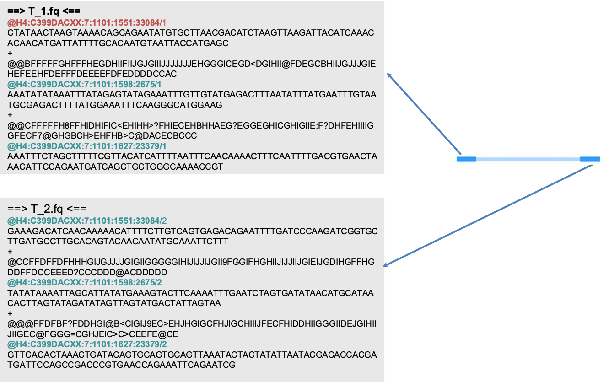
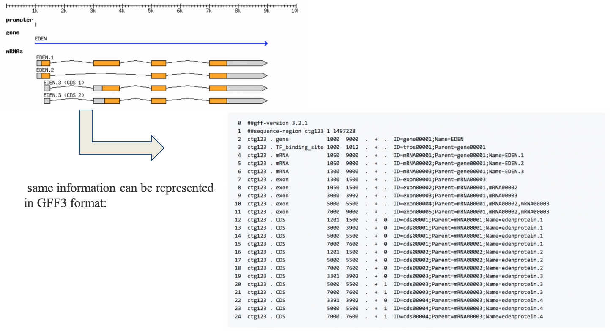
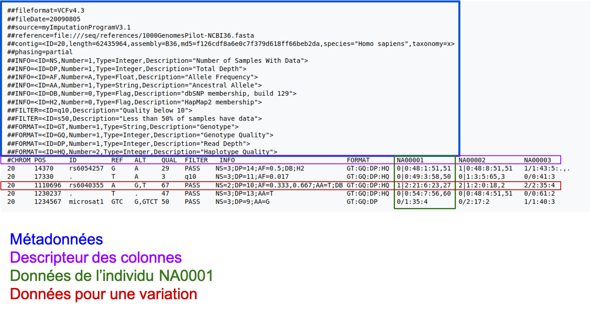

## Fastq

{: style="height:150px;width:150px"; align=right}

**1 séquence = 4 lignes**

{: style="height:500px;width:800px"}

### Illumina paire-end  

{: style="height:500px;width:800px"}

## GFF

{: style="height:500px;width:800px"}

## VCF

{: style="height:500px;width:800px"}