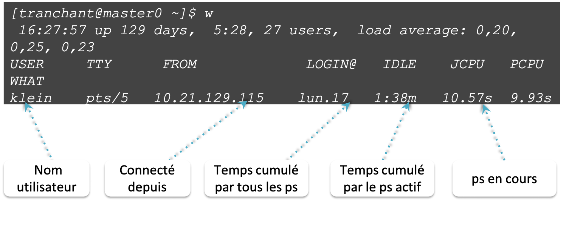

    les commandes `w`, `ps`, `kill`, `top` 

* `w` affiche les utilisateurs et les processus associés

{: style="height:300px;width:600px"} 

-----------------------

* `ps` liste les processus en train de tourner 
* `ps -uax` 		affiche la liste de tous les processus associés à chaque utilisateur