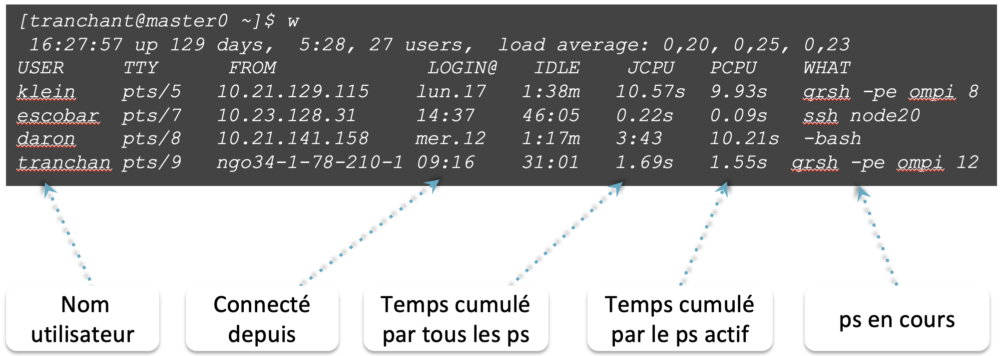
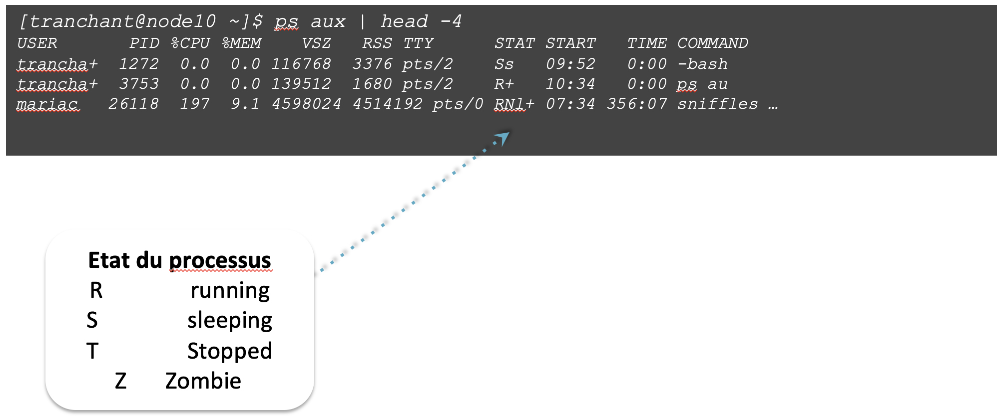

!!! info "Objectifs"
        les commandes `w`, `ps`, `kill`, `top` 


* `w` affiche les utilisateurs et les processus associés

{: style="height:400px;width:800px"}

-----------------------

* `ps` liste les processus en train de tourner 
* `ps -uax` 		affiche la liste de tous les processus associés à chaque utilisateur

{: style="height:400px;width:800px"}

-----------------------

* `top` liste les processus en train de tourner 

```
top - 16:44:51 up 156 days, 23:10,  1 user,  load average: 10,37, 9,80, 9,71
Tasks: 200 total,   3 running, 197 sleeping,   0 stopped,   0 zombie
%Cpu(s):  0,0 us,  0,1 sy, 88,5 ni, 11,5 id,  0,0 wa,  0,0 hi,  0,0 si,  0,0 st
KiB Mem : 65774384 total, 42442784 free,  1907228 used, 21424372 buff/cache
KiB Swap:  8388604 total,  5512296 free,  2876308 used. 62871460 avail Mem 

  PID USER      PR  NI    VIRT    RES    SHR S  %CPU %MEM     TIME+ COMMAND                                                                                                                   
18905 daron     30  10  916508 307308    976 R 960,8  0,5  51:38.57 admixture                                                                                                                 
 3446 daron     30  10 1130556 937640   2584 R 100,0  1,4 308:00.92 treemix                                                                                                                   
19307 trancha+  20   0  146164   2124   1424 R   0,3  0,0   0:00.02 top                                                                                                                       
22389 root      20   0       0      0      0 S   0,3  0,0   0:00.17 kworker/10:2                                                                                                              
```                                                                                                        

!!! tip
        `c` → Afficher la commande complète en exécution  
        `V` → Afficher en mode arborescence  
        `M`,`P` -> Trier les ps par %mem et %cpu  
        `1` → Afficher l’activité CPU (une ligne/CPU)  
        `u` → Faire une recherche sur un utilisateur en particulier  
        `i` → Ne pas afficher les tâches inactives (idle)  
        `q` →  pour quitter  


-----------------------

* `kill -9 <PID>` tuer un processus


```
[tranchant@master0 ~]$ ps aux | grep “tranchant”
tranchant   20999  0.0  0.0 116748  3532 pts/1    Ss+  13:24   0:00 -bash
tranchant   21669  0.0  0.0 176384 22752 pts/1    R    13:33   0:00 perl toggleGenerator.pl -d /data3/projects/riceAnnot/TOG5681/Illumina/

[tranchant@master0 ~]$ kill -9 21669
```

-----------------------

--8<-- "pages/practice/pratice_monitoring.md"