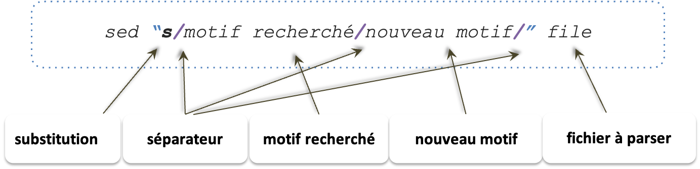

{: style="height:150px;width:150px"; align=right}

## Sed

### Selection

* Sélection et affichage de lignes dans un fichier __par numero de ligne__:  
```bash
sed -n `line p`   inputfile
```


| | |
| :-: | :-: |
| Affiche la 5ème ligne | `sed -n '5p' all.gff3` |
| sed -n '5p' *.fastq | `sed -n -s '5p' *.fastq` |
| Affiche la ligne 1 et 8 | `sed -n '1p; 8p' test.txt` |
| Affiche la ligne 1 à 8 | `sed -n '1,8 p' test.txt` |
| Affiche à partir de la ligne 1, toutes les 4 lignes | `sed -n '1~4p' ir.fastq` |


* Sélection de lignes dans un fichier __par motif__
```bash
sed 'ER p'   inputfile
```

| | |
| :-: | :-: |
| sed -n '/^Bonjour/p; /^Au revoir/p' test.sed | |
| sed -n '/^Bonjour/,/4.$/p' test.sed | |

### Suppresion 

* Suppression de lignes dans un fichier __par numero de ligne__: 
```bash
sed ‘line d '   inputfile
```

| | |
| :-: | :-: |
| sed “2d; 4d” test.txt	| # supprime ligne 2 et 4 |
| sed “2,4 d” test.txt 	| # supprime ligne 2 à 4 |
| sed  '2~4d' irigin1_1.fastq | | 

* Suppression de lignes dans un fichier __par motif__: 
```bash
sed 'ER p'   inputfile
```
| | |
| :-: | :-: |
| sed '/^#/d' test.sed  | |

### Substitution

* Substitution/Remplacement dans lignes  

Sélection de lignes dans un fichier vérifiant une expression régulière 
ET appliquant une modification ou un traitement

{: style="height:200px;width:800px"}

| Example | Description |
| :-: | :-: |
| `sed "s/day/night/" file`| Change la 1ère occurrence de “day” par “night” par ligne |
| `sed "s/linux/LINUX/2" file` | Change la 2ème  occurrence de “linux” par “LINUX” par ligne |
| `sed "s/[lL]inux/LINUX/g" file` | Change toutes occurrences de “linux” par “LINUX” |
